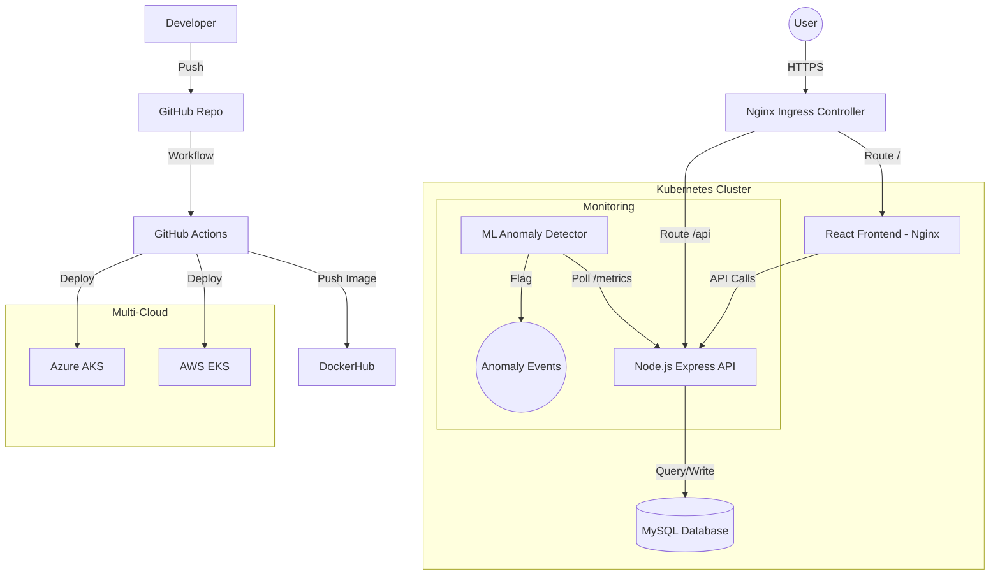

# Architecture Overview

## System Diagram

## Key Components

### 1. Frontend (React/Vite)
- Modern SPA served via Nginx.
- Responsive design with Tailwind CSS.
- Client-side routing.

### 2. Backend (Node.js/Express)
- RESTful API with JWT authentication.
- Integrated metrics and health check endpoints.
- Fault simulation logic for self-healing demos.

### 3. Database (MySQL)
- Relational data modeling with Sequelize.
- Persistent volume storage in Kubernetes.

### 4. Orchestration (Kubernetes)
- Multi-replica deployments for high availability.
- Automated rolling updates.
- Liveness and Readiness probes for self-healing.

### 5. AI/ML Module
- Python-based anomaly detection.
- Simple logic to identify performance degradation or service failure.
